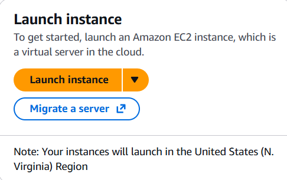
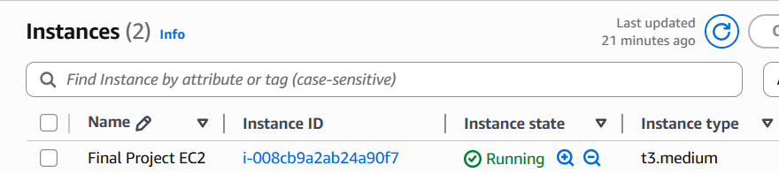

# Cloud Infrastructure
Cloud infrastructure is very important in the modern world if you have ever wondered how services like spotify, youtube, etc. are able to operate so seemlessly its becuase of the cloud although good internet is helpful using the cloud they are able to scale the services easily and quickly which also allows for instances where you can run things like docker to contaierize parts of your web app to work on it. 

# Creating a EC2 instance 
First you will need an AWS account and a accademey account works fine once you have that you will need to log in and navigate for accademy students you will need to find the learner lab and start it up and then click the AWS with the green dot and it will bring you to the console thne youll wanna locate the launch instance and click it. It will then bring up the instance creator  once you configure everything youll wanna click the launch instance button in the summary 

# Security Groups 
Security groups are very important so that not everyone can access your instances. So your gonna want to set up security groups to only allow IPs, Ports, etc. from the places you want. Having really good security groups in your instances is a great for having a secure instance 

# Connecting Your EC2 instance
First you will want to download PUTTY from the offical site here for Windows https://www.chiark.greenend.org.uk/~sgtatham/putty/latest.html  for Mac and Linux users you want to run this command # ssh -l ec2-user -i ~/.ssh/{your server address} and after it is installed youll want to open it and youll want to copy the instances IPv4 address and remember to do this EVERY time you start up the instance youll want to give it a name in the saved sessions and then save it and then youll need a .ppk key so youll need to navigate to the left side to the category section then look for SSH click it then look for Auth double click to get the credential then put your ppk key in there and your good to go